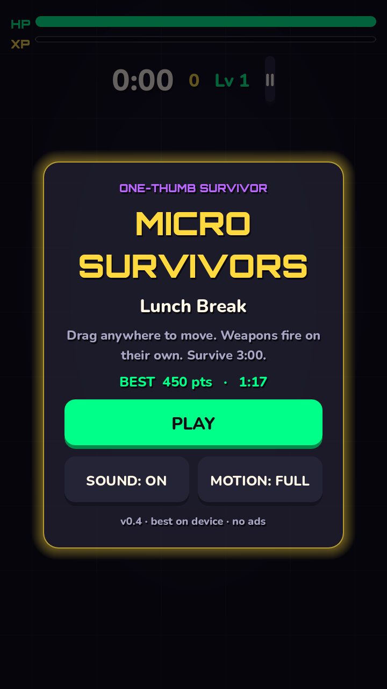
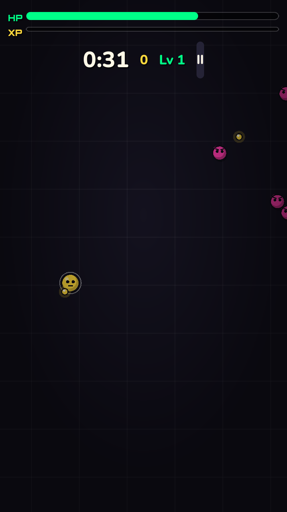
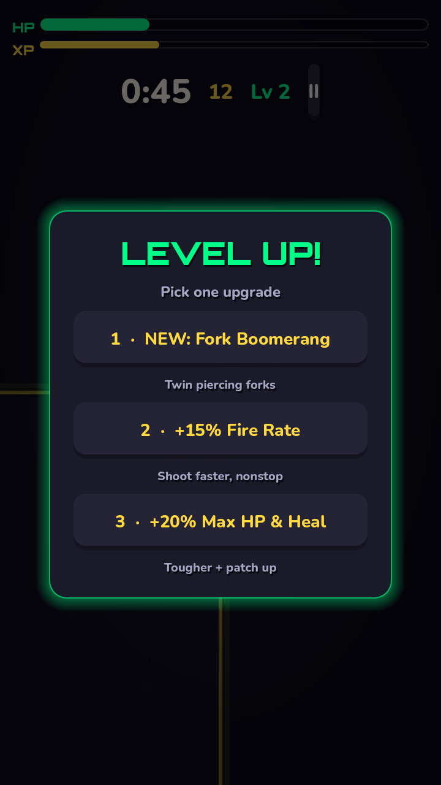
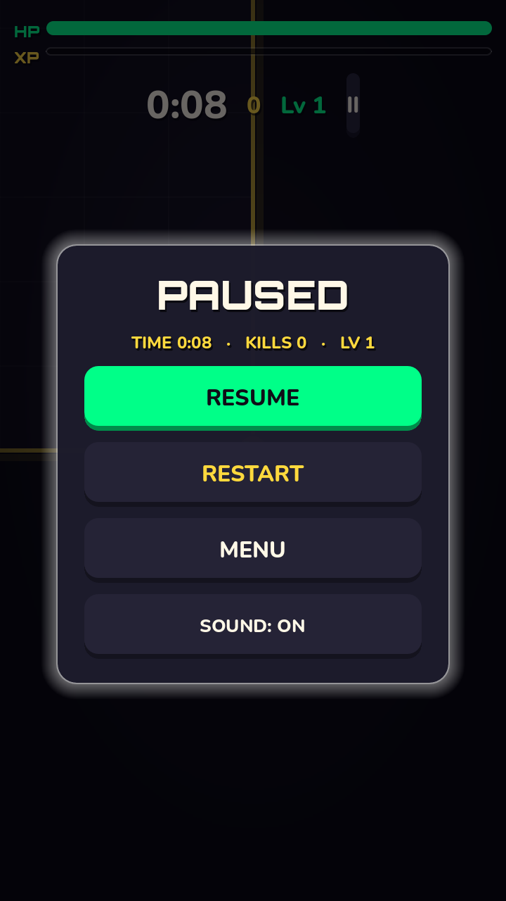
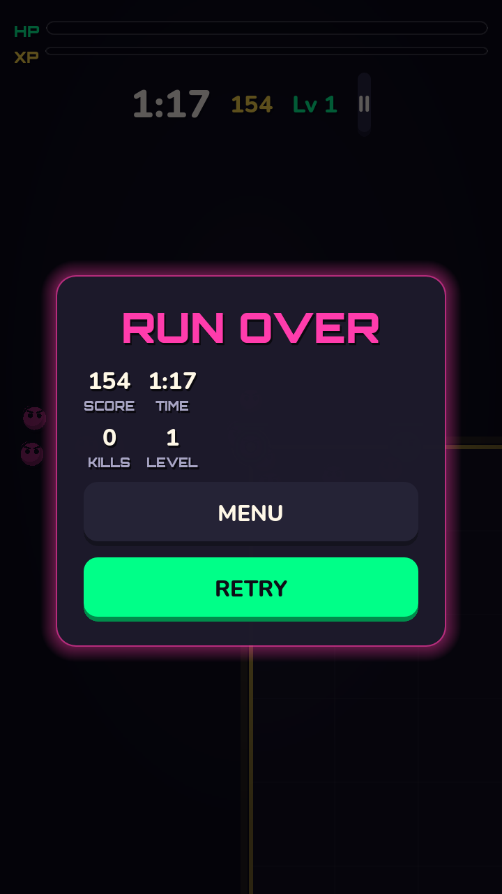

# Micro Survivors — Lunch Break

A one-thumb portrait survival game for Android, built with **Godot 4.7 + GDScript**.
Drag anywhere to move, weapons fire on their own. Survive 3:00 against the snack gremlins.

## Download

Latest debug APK (sideload-ready, arm64) is always under
**[Releases](https://github.com/krissirk0906/microsurvivors/releases)** —
e.g. `microsurvivors.apk` from v0.4. Enable *Install unknown apps* and tap to install.

## Screenshots

| Title | Gameplay |
|---|---|
|  |  |

| Level up | Pause | Game over |
|---|---|---|
|  |  |  |

## How to play

* **Move:** touch-drag anywhere (floating joystick) or WASD/arrows on desktop
* **Weapons fire automatically** at the nearest enemy
* Collect XP chips → level up → pick 1 of 3 upgrades (damage, fire rate, speed, magnet, max HP, Fork Boomerang)
* Survive to **3:00** to face the Broccoli Boss and win
* High score + best time are saved on device

## Project layout

```
project.godot          720x1280 portrait, mobile renderer
scenes/main.tscn       single main scene (everything else is code-built)
scripts/
  main.gd      game states, spawner wiring, score, save, camera, bursts
  player.gd    movement, HP/XP/levels, auto-weapons, upgrades
  enemy.gd     chimp / slime / boss chase AI + contact damage
  bullet.gd    projectiles with pierce
  gem.gd       XP pickups with magnet
  spawner.gd   wave director (ramps to 0.35s interval + boss at 3:00)
  hud.gd       HUD, title / level-up / pause / game-over screens, touch joystick
  sounds.gd    runtime-synthesized SFX (no audio files)
  save.gd      highscore, best time + sound/motion prefs (ConfigFile)
assets/fonts/          Orbitron Black (display) + Nunito ExtraBold (UI)
export_presets.cfg     Android APK preset (arm64, portrait, debug)
```

Art and SFX are 100% procedural (drawn/generated in code) — no binary assets.

## Build it yourself

Requires Godot 4.7, OpenJDK 17, Android SDK (platform-tools, build-tools 35.0.1,
platform 35, NDK r28b, CMake 3.10.2) and the 4.7 export templates.

```bash
godot --headless --import --path .
godot --headless --path . --export-debug "Android" build/microsurvivors.apk
```

Headless smoke test (bot plays a full run, exercises pause + level-ups):

```bash
godot --headless --path . --quit-after 4000 -- autotest
```

Rendered screenshots (needs xvfb):

```bash
xvfb-run -a godot --rendering-driver opengl3 --resolution 720x1280 \
  --path . --quit-after 200 -- shot=title   # title | game | levelup | pause | over
```

## Design notes

UI/UX follows an 18-point checklist drawn from two open-source Claude skills
(`game-ui` from Claude-Code-Game-Studios, `ux-designer`): pause menu instead of
silent freeze, first-run hint, thumb-zone CTAs, 44dp+ touch targets, damage
flash + haptics, persisted sound/reduce-motion prefs, numbered upgrade cards.

## Versions

* **v0.5** — Stitch redesign pass (chunky arcade buttons, neon panel rims, upgrade descriptions, pause stats, game-over grid + NEW BEST, gem group fix)
* **v0.4** — camera/visual bugfixes found via rendered screenshots, persisted prefs, VIBRATE permission
* **v0.3** — skill-driven UX pass (pause menu, hint, haptics, toggles)
* **v0.2** — UI overhaul (fonts, restyled HUD/menus)
* **v0.1** — one-session MVP
